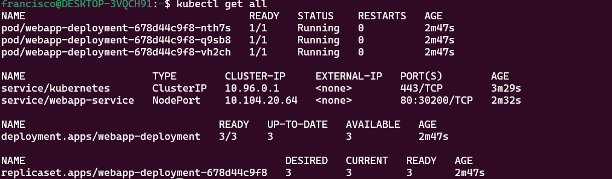
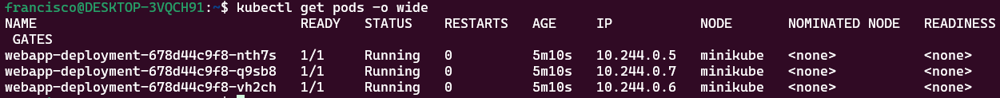
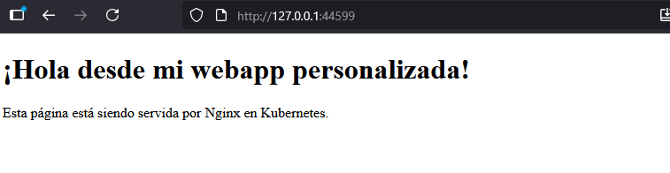
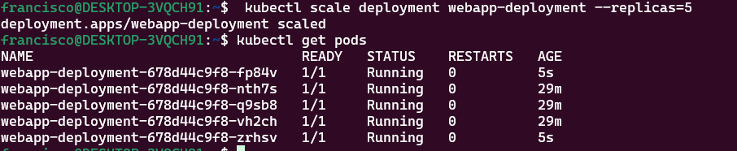

### 1. Encabezado

# Nombre de tu Aplicación

**Curso:** Docker & Kubernetes - Clase 6
**Estudiante:** Francisco Humberto Flores Huanca

Aplicacion Nginx

### 2. Tecnología

## Stack

- **Aplicación:** Nginx .
- **Kubernetes:** minikube
- **Réplicas:** 3

### 3. Cómo Ejecutar

## Ejecución

1. Clonar:
   
   git clone https://github.com/franciscohf/kubernetes-clase6
   cd kubernetes-clase6
   

2. Desplegar:
   kubectl apply -f webapp-configmap.yaml
   kubectl apply -f deployment.yaml
   kubectl apply -f service.yaml
   

3. Acceder:
   - URL: http://192.168.49.2:30200
   - minikube service webapp-service

┌───────────┬────────────────┬─────────────┬───────────────────────────┐
│ NAMESPACE │      NAME      │ TARGET PORT │            URL            │
├───────────┼────────────────┼─────────────┼───────────────────────────┤
│ default   │ webapp-service │ 80          │ http://192.168.49.2:30200 │
└───────────┴────────────────┴─────────────┴───────────────────────────┘

Starting tunnel for service webapp-service

┌───────────┬────────────────┬─────────────┬────────────────────────┐
│ NAMESPACE │      NAME      │ TARGET PORT │          URL           │
├───────────┼────────────────┼─────────────┼────────────────────────┤
│ default   │ webapp-service │             │ http://127.0.0.1:44599 │
└───────────┴────────────────┴─────────────┴────────────────────────┘

### 4. Cómo Probar

## Verificación

1. Ver recursos:
   kubectl get all

2. Acceder a la web: http://192.168.49.2:30200

3. Escalar:
   kubectl scale deployment webapp-deployment --replicas=5
   kubectl get pods

### 5. Capturas de Pantalla

## Screenshots

### Recursos desplegados

### Replicas corriendo

### Aplicación funcionando

### Escalado a 5 réplicas

### Bonus 2: Rolling Update (10 puntos)

Actualiza la imagen a `nginx:1.26-alpine` y documenta:

### kubectl set image deployment/webapp-deployment nginx=nginx:1.26-alpine
1. Resultado:

deployment.apps/webapp-deployment image updated

### kubectl rollout status deployment webapp-deployment
2. Resultado:

deployment "webapp-deployment" successfully rolled out

### kubectl rollout history deployment webapp-deployment
3. Resultado:

deployment.apps/webapp-deployment
REVISION  CHANGE-CAUSE
1         <none>
2         <none>

### kubectl describe deployments.apps webapp-deployment

Name:                   webapp-deployment

Namespace:              default

CreationTimestamp:      Thu, 16 Oct 2025 20:58:25 -0400

Labels:                 app=webapp

                        env=homework

Annotations:            deployment.kubernetes.io/revision: 2

Selector:               app=webapp

Replicas:               5 desired | 3 updated | 7 total | 4 available | 3 unavailable

StrategyType:           RollingUpdate

MinReadySeconds:        0

RollingUpdateStrategy:  25% max unavailable, 25% max surge

Pod Template:

  Labels:  app=webapp

           env=homework

  Containers:
  
   webapp:
    Image:        nginx:1.26-alpine

    Port:         80/TCP

    Host Port:    0/TCP

    Environment:  <none>

    Mounts:
      /usr/share/nginx/html/index.html from html-volume (rw,path="index.html")

  Volumes:

   html-volume:

    Type:          ConfigMap (a volume populated by a ConfigMap)

    Name:          webapp-configmap
    
    Optional:      false

  Node-Selectors:  <none>

  Tolerations:     <none>

Conditions:

  Type           Status  Reason
  ----           ------  ------

  Available      True    MinimumReplicasAvailable

  Progressing    True    ReplicaSetUpdated

OldReplicaSets:  webapp-deployment-678d44c9f8 (4/4 replicas created)

NewReplicaSet:   webapp-deployment-56df784bd8 (3/3 replicas created)

Events:

  Type    Reason             Age   From                   Message
  ----    ------             ----  ----                   -------

  Normal  ScalingReplicaSet  44m   deployment-controller  Scaled up replica set webapp-deployment-678d44c9f8 from 0 to 3

  Normal  ScalingReplicaSet  15m   deployment-controller  Scaled up replica set webapp-deployment-678d44c9f8 from 3 to 5

  Normal  ScalingReplicaSet  4s    deployment-controller  Scaled up replica set webapp-deployment-56df784bd8 from 0 to 2

  Normal  ScalingReplicaSet  4s    deployment-controller  Scaled down replica set webapp-deployment-678d44c9f8 from 5 to 4

  Normal  ScalingReplicaSet  4s    deployment-controller  Scaled up replica set webapp-deployment-56df784bd8 from 2 to 3